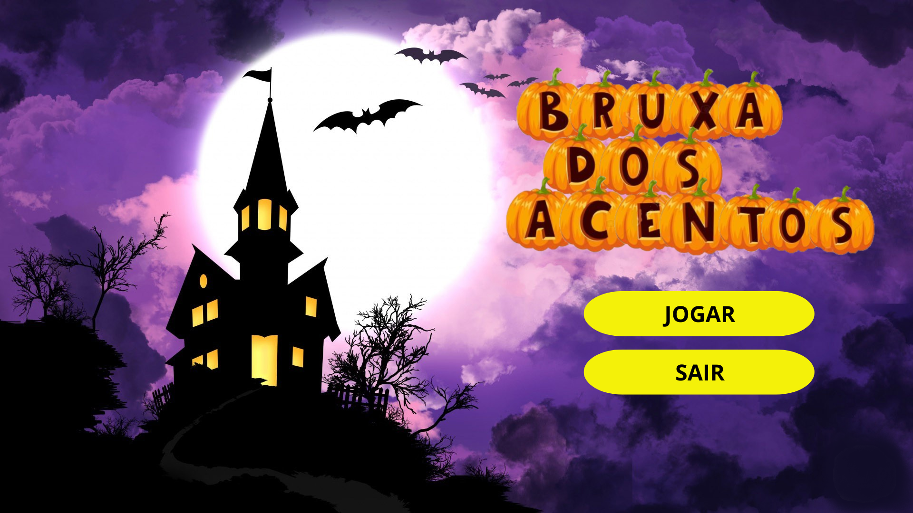

### Inspirado no jogo Bruxa dos acentos da Escola Games

## Projeto de Prática de Programação
Projeto desenvolvido para a disiciplina de Prática de Programação (INF1124) da Universidade Católica de Pernambuco (UNICAP).

### Exercício: 
Desenvolver um jogo educativo infatil.

### Bruxa dos acentos:
No jogo, a bruxa dos acentos roubou todos os acentos gráficos das palavras e ela ainda acha que o til é um acento. É preciso usar o conhecimento para colocar os acentos e o til no lugar correto em cada palavra que aparecer na tela.

